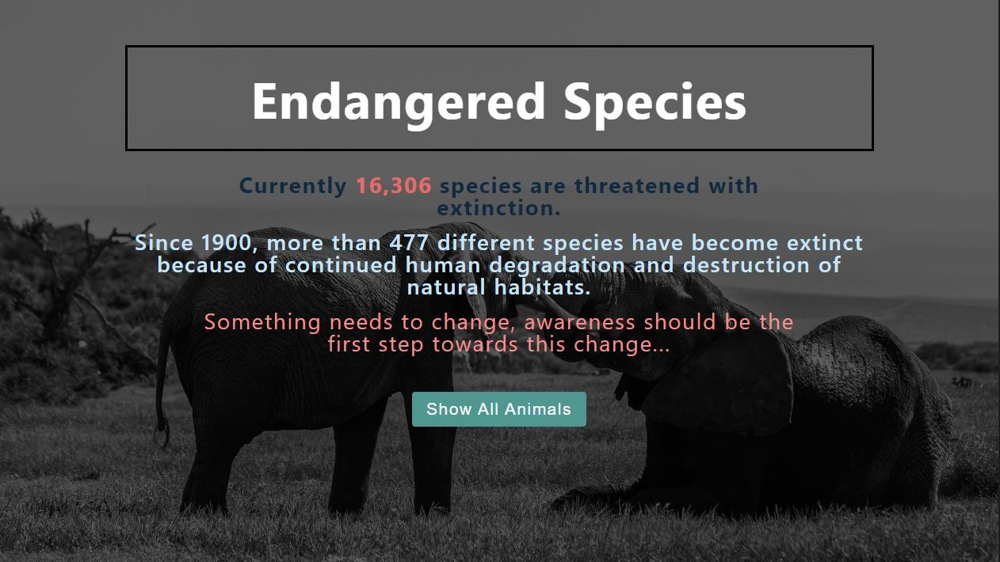
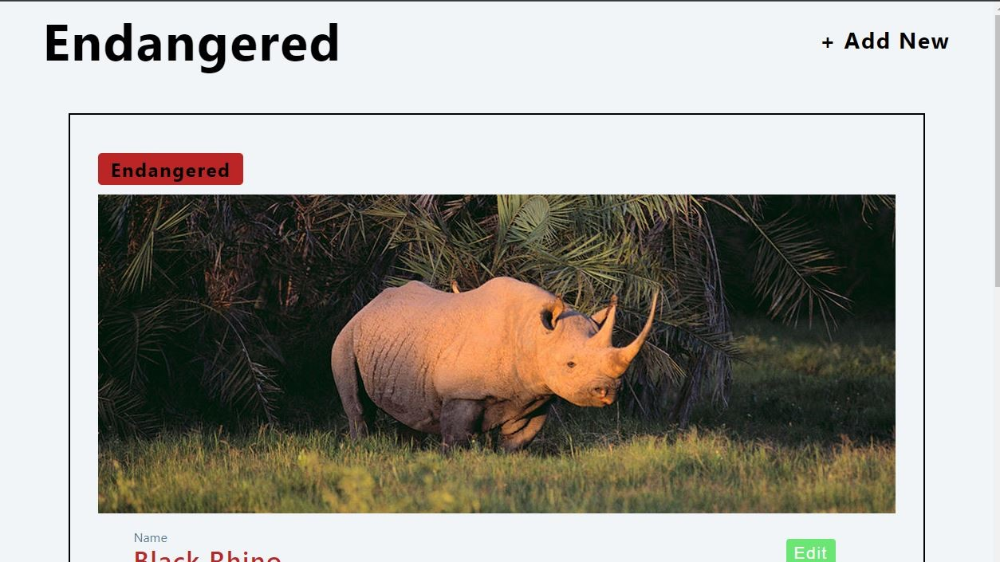
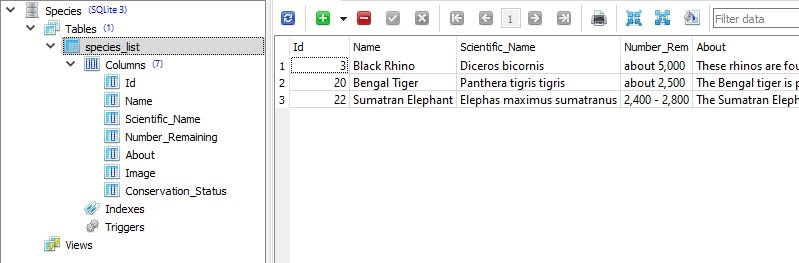

## What
A simple project to display animals on the UI with details like name, Scientific Name and Classification(Endangered/Not Endangered). A user can also edit or remove the animals from the UI. User can also add new animals to the database.

## Why
To learn:
- RESTFUL Routing
- Using SQL database using NodeJS
- Use of Sqlite3

## How to run
1. Install the Dependencies
`npm install`
2. Run the script
`npm start`
3. The project will now run on localhost:3000

## Technologies Used
1. EJS
2. Express
3. Nodemon
4. Sqlite3

## What to expect
| Landing Page  | DisplayPage | Edit Page |
| ------------- | ------------- | ------------- |
|   |   |  |

| Add Page  | Database |
| ------------- | ------------- |
|   |   |

